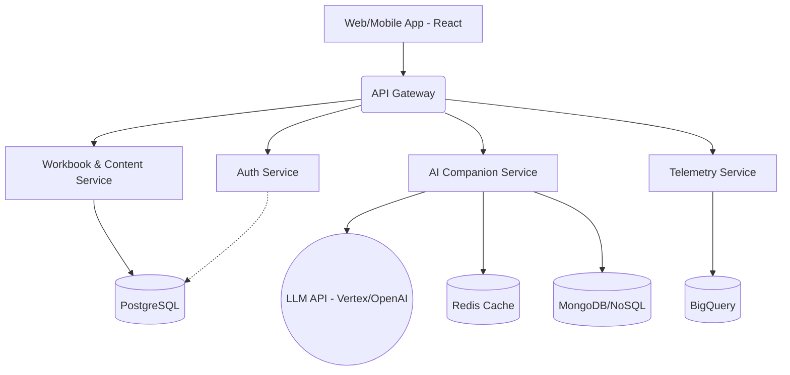

# SagipIsip: AI-Powered Mental Health & Wellbeing Platform

> [!NOTE]
> **Executive Summary from Senior Business Analyst**
> SagipIsip is a comprehensive, enterprise-grade application aimed at revolutionizing mental health care, particularly for the youth. Based on the provided literature on AI in behavioral health, cognitive behavioral therapy (CBT), and ethical AI companions, the platform will offer AI-driven counseling, mental health tracking, and productivity tools while maintaining the highest ethical and data privacy standards (HIPAA/GDPR compliance).

## User Review Required

> [!IMPORTANT]
> **To proceed with this plan, we need your approval on the following key decisions:**
> 1. **Cloud Provider:** The architecture is designed around Google Cloud Platform (GCP) to follow the "Google standard," but can be adapted to AWS or Azure.
> 2. **AI Provider:** We plan to use OpenAI (GPT-4) or Google Vertex AI (Gemini) for the AI companion features. Do you have a preference?
> 3. **Monetization / User Tiers:** Will there be a freemium model (e.g., basic workbook access free, AI companion paid)?

## Open Questions

> [!WARNING]
> * Do we need to integrate with existing hospital or clinic Electronic Health Record (EHR) systems?
> * Are there specific regulatory bodies in your target region (e.g., DOH in the Philippines, given the name "SagipIsip") that we need strict compliance with?

---

## 1. System Architecture (Senior System Architect)

We will adopt a **Microservices Architecture** deployed on a Kubernetes cluster (GKE) for high availability, scalability, and robust fault tolerance. 

### High-Level Components:
* **API Gateway:** Traefik or Kong to handle rate limiting, SSL termination, and routing.
* **Identity & Access Management (IAM):** OAuth2.0 / OIDC based on Google Identity Platform or Keycloak.
* **Core Services:**
  * **User Profile & Settings Service**
  * **AI Companion Service:** Interfaces with LLMs, maintains conversation state, and ensures ethical bounds (toxicity filtering).
  * **Content Delivery Service:** Serves CBT/DBT workbooks, productivity modules, and communication training materials.
  * **Analytics & Telemetry Service:** Aggregates user progress and mental health metrics securely.
* **Event Bus:** Apache Kafka or Google Cloud Pub/Sub for asynchronous communication (e.g., triggering alerts if a user indicates self-harm).

---

## 2. Database Design & Administration (Senior DBA & DB Designer)

We will use a polyglot persistence strategy, choosing the right database for the right job.

* **Primary Relational DB (PostgreSQL):** For structured, transactional data.
  * `Users`, `Profiles`, `Subscriptions`, `Therapist_Assignments`
  * Strong ACID compliance, Row-Level Security (RLS) for tenant/user isolation.
* **Document Database (MongoDB or Firestore):** For high-volume, unstructured or semi-structured data.
  * `Chat_Histories`, `Workbook_Entries`, `Journal_Logs`.
* **Caching Layer (Redis):** For session management, rate-limiting, and real-time active user tracking.
* **Data Warehouse (Google BigQuery):** For anonymized, aggregated analytics to improve AI models and track system efficacy.

> [!TIP]
> **Data Security & Privacy:** All databases will have encryption at rest (AES-256) and in transit (TLS 1.3). PII (Personally Identifiable Information) and PHI (Protected Health Information) will be tokenized or masked.

---

## 3. Frontend Development (Senior React Developer)

**Tech Stack:** Next.js (React 18+), TypeScript, Tailwind CSS (or Material UI), Redux Toolkit / Zustand, React Query (for server state).

**Architecture:**
* **Monorepo:** Using Turborepo for sharing components between the Patient Web App and the Admin/Therapist Dashboard.
* **Server-Side Rendering (SSR):** Next.js for SEO on landing pages and faster Time-To-Interactive (TTI).
* **Progressive Web App (PWA):** Offline support for journal entries and reading downloaded materials.
* **State Management:** `React Query` for data fetching/caching; `Zustand` for global UI state (e.g., active chat window, dark mode).

---

## 4. UI/UX & Web Design (Senior UI/UX & Web Designer)

The design must evoke calmness, trust, and professionalism.

* **Color Palette:** Soft blues, greens, and warm neutrals (e.g., Teal, Sage, Ivory). Avoid harsh reds or alarming colors.
* **Typography:** Inter or Roboto (highly legible, accessible fonts).
* **Micro-interactions:** Smooth, calming animations (framer-motion) to reward user progress (e.g., finishing a CBT module).
* **Accessibility (a11y):** Strict WCAG 2.1 AA compliance. Screen-reader friendly, high contrast modes, and scalable text.
* **Conversational UI:** The AI chat interface will feel human and empathetic, with clear indicators when the AI is "typing" or "thinking."

---

## 5. Backend Development (Senior NestJS Developer)

**Tech Stack:** NestJS (Node.js framework), TypeScript, GraphQL + Apollo, Prisma (ORM), Jest.

**Architecture:**
* **Domain-Driven Design (DDD):** Code structured by feature (e.g., `UsersModule`, `ChatModule`, `HealthTrackingModule`).
* **GraphQL APIs:** For flexible data fetching by the React frontend, reducing over-fetching (crucial for mobile performance).
* **WebSockets (Socket.io):** For real-time, bi-directional communication in the AI Companion chat.
* **Dependency Injection & Decorators:** Leveraging NestJS's core features for clean, testable code.
* **Guards & Interceptors:** For robust authorization, JWT validation, and response formatting/logging.

---

## 6. Quality Assurance (Senior QA Engineer)

A multi-tiered testing strategy integrated directly into CI/CD pipelines (GitHub Actions / GitLab CI).

1. **Unit Testing:** `Jest` for both React (components, hooks) and NestJS (services, controllers). Requirement: >80% code coverage.
2. **Integration Testing:** Testing NestJS endpoints against a test database instance (using Testcontainers).
3. **End-to-End (E2E) Testing:** `Playwright` or `Cypress` to simulate real user journeys (e.g., logging in, completing a workbook exercise, chatting with the AI).
4. **Load/Stress Testing:** `k6` to ensure the AI websocket connections and API gateway can handle high traffic.
5. **Security Scanning:** SAST/DAST tools (e.g., SonarQube, OWASP ZAP) and dependency vulnerability scanning (Snyk).
6. **Ethical AI Audits:** Specialized QA testing to ensure the AI does not output harmful advice, biased statements, or cross professional boundaries.

---

## Verification Plan

### Phase 1: PoC (Proof of Concept)
1. Initialize the monorepo structure.
2. Set up Next.js boilerplate and NestJS backend.
3. Build a simple End-to-End text chat flow with a dummy AI endpoint.
4. Verify websocket connection stability.

### Phase 2: MVP (Minimum Viable Product)
1. Integrate chosen LLM (OpenAI/Gemini).
2. Implement User Auth and Database schemas.
3. Deploy to a staging environment (GCP Cloud Run / Vercel).
4. Manual verification by stakeholders.

### Phase 3: CBT Workbook Feature
1. **Backend Endpoints**: Build CRUD endpoints for `WorkbookEntry` in NestJS (e.g., `/workbooks`).
2. **Frontend UI**: Create a dashboard and detailed view for CBT exercises (e.g., Cognitive Restructuring, Behavior Activation).
3. **Integration**: Link workbook progress to the user's profile and allow the AI companion to reference workbook activities.
4. **Verification**: E2E test of completing a workbook module.

### Phase 4: Mood Tracking & Chat History
1. **Mood Logging**: Create endpoints (`/moods`) to allow users to log their daily mood and notes.
2. **Chat Persistence**: Update the `ChatGateway` to save incoming user messages and outgoing AI responses into the `ChatHistory` table.
3. **Frontend Dashboard**: Add a mood check-in widget on the main page and a history drawer to view past conversations.
4. **Integration**: Supply the user's recent mood logs to the AI companion context for more personalized empathy.

### Phase 5: Therapist / Admin Dashboard [COMPLETED]
1. **Role-Based Access Control (RBAC)**: Update the `User` schema in Prisma to include a `Role` enum (e.g., `PATIENT`, `THERAPIST`, `ADMIN`). Add guards in NestJS to protect therapist routes.
2. **Patient Data Endpoints**: Create endpoints (`GET /patients`) allowing therapists to securely fetch aggregated data (mood trends, workbook entries) of users.
3. **Frontend Dashboard UI**: Build a new Next.js route (`/therapist`) showcasing a data grid or list of patients, with detailed views to monitor their well-being metrics.
4. **Data Visualization**: Integrate simple charts (e.g., Recharts) to visualize a patient's mood over time for quick clinical insights.

### Phase 6: Deployment Preparation
1. **Containerization**: Create optimized multi-stage `Dockerfile`s for both the NestJS backend and the Next.js frontend.
2. **Docker Compose Integration**: Update the root `docker-compose.yml` to include the new `frontend` and `backend` services alongside the existing infrastructure (PostgreSQL, Redis, Ollama), allowing the entire stack to be spun up with a single command.
3. **Environment Configuration**: Set up production-ready environment variables, ensuring secure connection strings for Prisma and CORS configurations for NestJS.
4. **Database Seeding**: Create a Prisma seed script to automatically populate the database with a default Admin/Therapist account and dummy patient data to make initial testing easier.
